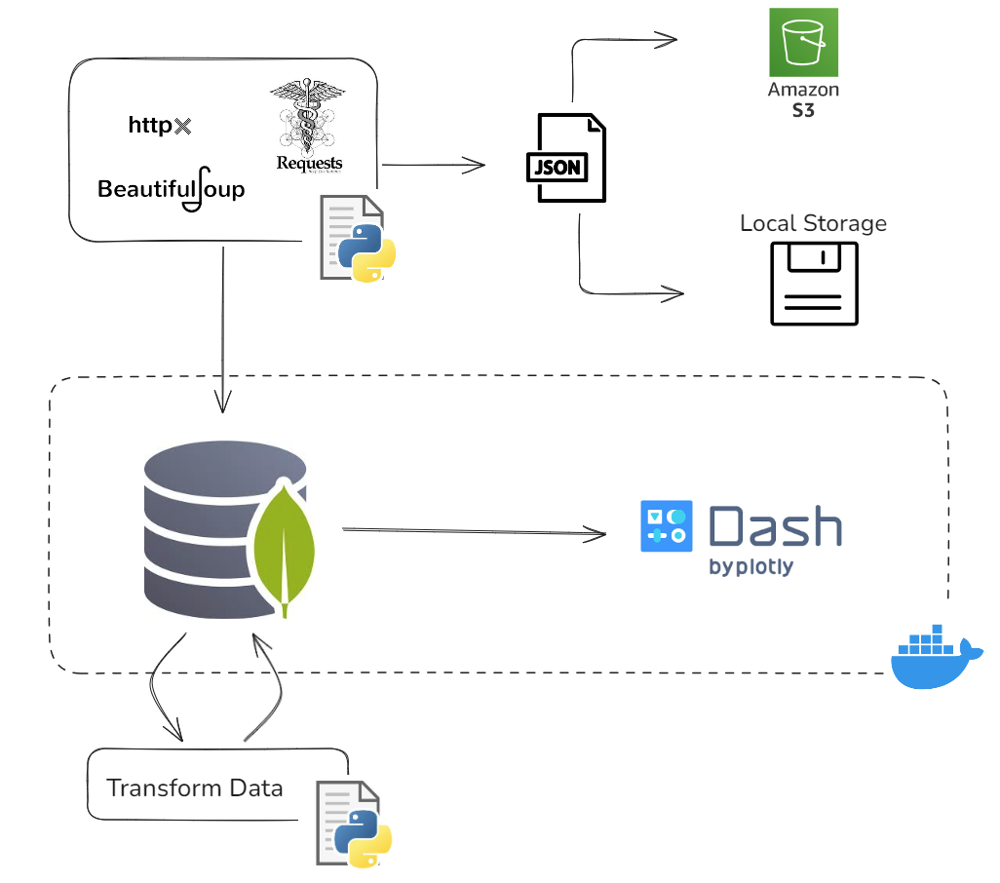

# Property Sales Dashboard Using Real Data Crawled from Real Estate Website

This repository consists of an implementation of a dashboard containing data scraped from a real estate website: [Imovirtual](https://www.imovirtual.com/), a Portuguese real estate website offering homes, apartments, and other properties for sale and rent. Using MongoDB as the database, it crawls raw data, cleans it, and makes it ready to be used in the dashboard.

Both the dashboard and the scripts to crawl the data were implemented using Python. The dashboard uses the [Dash](https://dash.plotly.com/) and [Dash Bootstrap Components](https://dash-bootstrap-components.opensource.faculty.ai/) frameworks. To scrape the data, it uses [Requests](https://requests.readthedocs.io/en/latest/), asynchronous requests with [HTTPX](https://www.python-httpx.org/), and [BeautifulSoup](https://beautiful-soup-4.readthedocs.io/en/latest/).

By setting the environmental variables, the script can store the scraped raw data in three different sources: MongoDB using [pymongo](https://pymongo.readthedocs.io/en/stable/#), an AWS S3 bucket as a JSON file (using [boto3](https://boto3.amazonaws.com/v1/documentation/api/latest/index.html)), and local storage as a JSON file.


It's possible to run the dashboard using Docker Compose.

## Table of Contents

- [How it works](#how-it-works)
  - [Data Ingestion](#data-ingestion)
  - [Dashboard](#dashboard)
- [How to run this project](#how-to-run-this-project)
  - [Dash with Docker](#dash-with-docker)
  - [Local Setup](#local-setup)
  - [MongoDB local backup](#mongodb-local-backup)
- [Further Improvements](#further-improvements)

## How it works

The project is divided into two blocks that can work separately, each inside the `src` folder:

- **Data Ingestion**: Responsible for crawling the data, consolidating it in the database while avoiding duplicates, and preparing the data for use in the dashboard.
- **Dashboard**: Uses the cleaned and filtered data from the database.




### Data Ingestion

All the code related to data ingestion is inside the `src/ingestion` folder. It creates three collections in MongoDB:

- A raw collection for storing the crawled data.
- A consolidated collection that maintains an historical record of the data.
- A dashboard collection used by the dashboard.

The raw collection, which comes from the crawler, can store data in MongoDB, an AWS S3 bucket as a JSON file, or locally as a JSON file, depending on the settings in the `.env` file.

The consolidation process creates a new collection in MongoDB and removes duplicate values from the raw data. It compares the raw data with the consolidated collection, allowing only new advertisements to be inserted and updating advertisements that are no longer available on the website. It filters unique entries using the same ID retrieved from the website for each advertisement. The goal of consolidation is to maintain a historical record of advertisements, even if they are no longer available on the website.

For the data used in the dashboard, a new collection is created. This pipeline extracts data from one of the previous collections (raw or consolidated), filters and transforms it so that it is ready for use in the dashboard.

For this specific website, it was possible to use asynchronous requests. In the first request, pagination information is retrieved for our search. This allows us to make an initial request to obtain this information, construct a block of URLs for requests, and perform asynchronous requests. After the requests, the data is extracted.

### Dashboard

All the data used in the dashboard is loaded directly from the MongoDB collection designed for it. The folder and file structures inside `src/dash` were designed to load the data from MongoDB only once, and the components import the data from the same source file.

To build the graphs and manipulate the data, it uses [Plotly](https://plotly.com/python/) and [Pandas](https://pandas.pydata.org/docs/index.html).


## How to run this project

This section explains how to run the project.

All the steps here are intended for a `bash` terminal.

The project setup uses [`pyenv`](https://github.com/pyenv/pyenv) and [`poetry`](https://python-poetry.org/).

As mentioned before, this project operates in two blocks, and it is possible to run both of them independently. Using Docker Compose, you can run the dashboard locally connected to the database. The Docker Compose setup includes an entrypoint that populates the database with the JSON file located at [scripts/data/data.json](scripts/data/data.json) if the collection does not already exist in MongoDB.

1 - Clone the repo locally:
```bash
git https://github.com/lealre/crawler-to-dash.git
```

2 - Access the project directory:
```bash
cd crawler-to-dash
```

To run this properly, it's necessary to create the `.env` variable file in the root of the project. An example can be found in [.env-example](.env-example). The default configuration to connect with MongoDB is:
```
MONGO_HOST='mongodb'
MONGO_PORT=27017
MONGO_DATABASE='db'
```

### Dash with Docker

- [Docker](https://www.docker.com/)
- [Install Docker Compose](https://docs.docker.com/compose/install/)

After completing steps 1 and 2, and with the `.env` variable file configured:

Build the image:
```bash
docker compose buid
```

Build the container:
```bash
dokcer compose up
```

Access the local host:
```
http://localhost:8051/
```

**NOTE:** It may be necessary to make the script `./entrypoint.sh` executable before building the container:
```bash
chmod +x entrypoint.sh
```

### Local Setup

After completing steps 1 and 2, and with the `.env` variable file configured:

3 - Set the Python version with `pyenv`:
```bash
pyenv local 3.12.2
```

4 - Create the virtual environment:
```bash
poetry env use 3.12.2
```

5 - Activate the virtual environment:
```bash
poetry shell
```

6 - Install dependencies:
```bash
poetry install
```

7 - Run the data pipeline, from crawling to dashboard data:
```bash
task crawl_to_dash
```

It is also possible to run each step separately:

To run just the crawler:
```bash
task crawl
```

Based on the `.env` variables, it will store the data in different possible sources.
```
USE_STORAGE_LOCAL=False
USE_STORAGE_MONGO=False
USE_STORAGE_AWS_S3=False
```

To run just the data consolidation:
```bash
task consolidate
```

To generate the dash data:
```bash
task dash_data
```

### MongoDB local Backup

The script [mongo_backup.sh](mongo_backup.sh) dumps the database to local storage in a file format. It uses the paths and container name specified in `.env` file.

The script first dumps the database content to a file inside the container, and it then copies the dump file from the container to the local storage.

Make the script executable:
```bash
chmod +x mongo_backup.sh
```

Execute the backup script:
```bash
./mongo_backup.sh
```

The `.env` file should contain the following variables:
```
CONTAINER_NAME="container-name"
BACKUP_PATH="/path/in/container"
LOCAL_BACKUP_PATH="/local/path/to/export"
```

## Further Improvements

- Improve the Dashboars style like font size, colors and callbacks intaration;